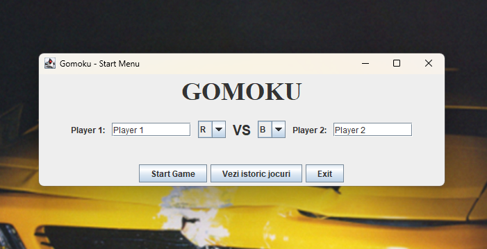
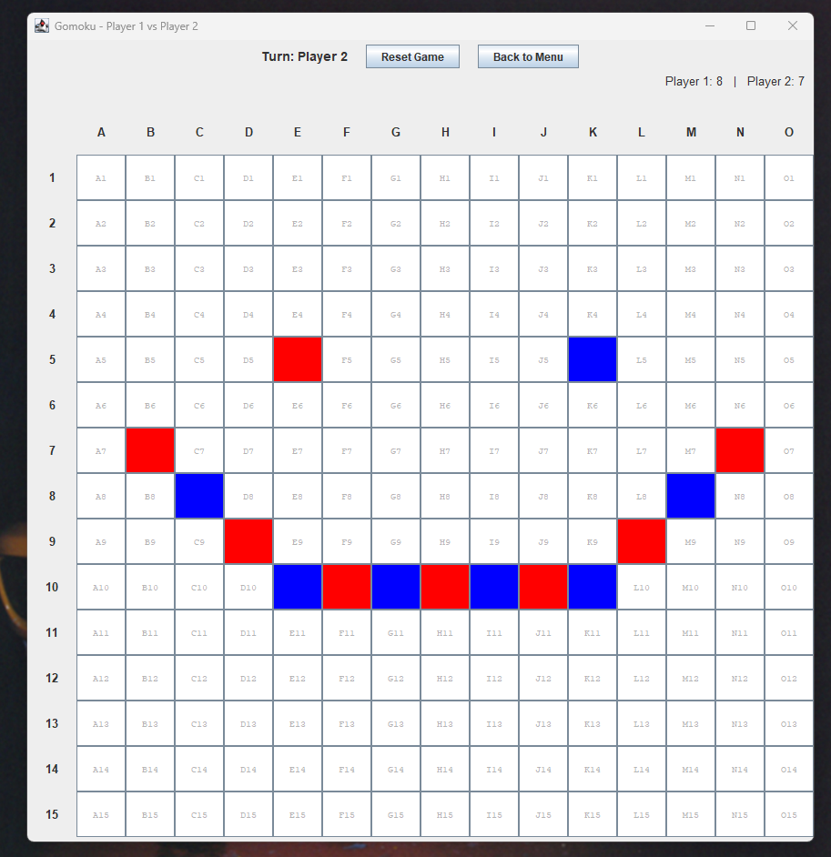
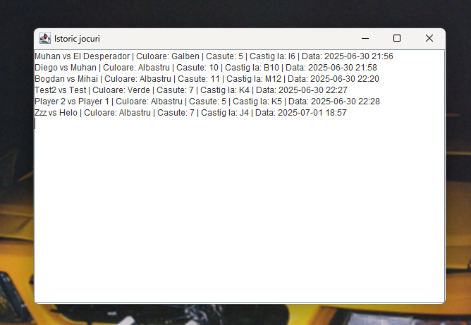

# Gomoku (Cinci in linie) - Proiect Java

---

## Descriere

Acest proiect este o implementare a jocului Gomoku (5 in linie) folosind Java si biblioteca Swing pentru interfata grafica.  
Jocul permite 2 jucatori, alegerea culorii fiecarui jucator, afisarea scorului, istoric de jocuri si salvarea automata a rezultatelor intr-un fisier local.

---

## Arhitectura proiectului

- `GomokuBoard.java` — modelul logicii jocului (tabla, verificare castig)
- `GomokuGUI.java` — interfata grafica principala cu tabla de joc si scor
- `StartMenu.java` — meniul de pornire, alegerea jucatorilor si vizualizarea istoric

---

## Functionalitati implementate

- Alegerea numelui si culorii fiecarui jucator
- Afisare tabla 15x15 cu coordonate (A1, B2 etc.)
- Mutari marcate prin casute colorate
- Numaratoare de casute ocupate de fiecare jucator
- Detectarea automata a castigatorului (5 in linie)
- Salvare rezultat meci intr-un fisier local (`game_results.txt`)
- Istoric afisabil din meniu
- Butoane „Back to Menu” si "Reset Game"  

---

## Capturi de ecran

Start Menu:  
  

Tabla de joc Gomoku:  
  

Istoricul Jocurilor:  
  

---

##  Cum rulez aplicatia?

1. Deschide proiectul in IntelliJ IDEA

3. Ruleaza clasa Main (src → main → java → Main) ca aplicatie (click dreapta → Run)  

---

  
Autor: Axente Andrei-Eugen   
IDE: IntelliJ IDEA Community Edition  

